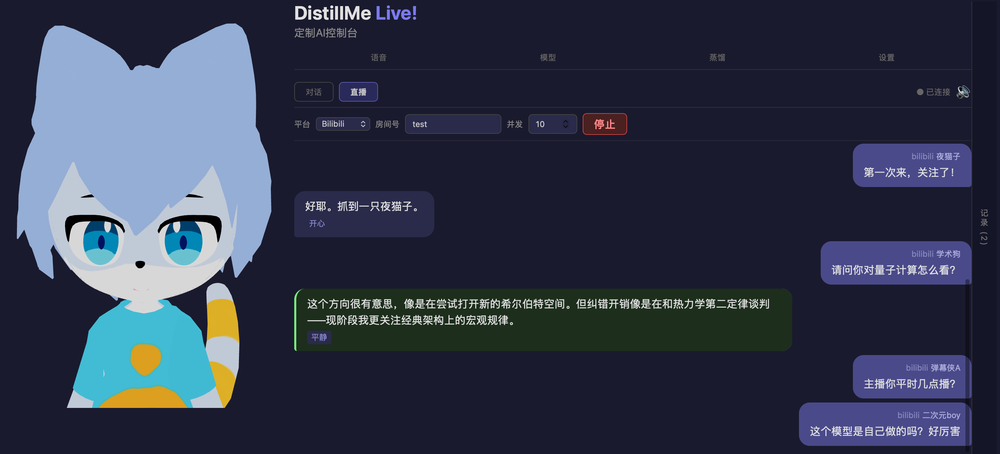

<div align="center">

# DistillMe VTuber

### Give Your Digital Twin a Voice

*"Distill a soul, give it a body, then — go live."*

[](https://opensource.org/licenses/MIT)
[](https://nodejs.org/)
[](https://github.com/SonnyNondegeneracy/distill-me)

[Quick Start](#quick-start) · [Features](#features) · [Livestream](#livestream-integration) · [Architecture](#architecture) · [中文](README.md)

</div>

---

## What Is This

[DistillMe](https://github.com/SonnyNondegeneracy/distill-me) distills a digital soul with memory and personality. **DistillMe VTuber** gives it a 3D body — **speaking, emoting, and interacting live**.

Upload materials → one-click persona distillation → VRM avatar → voice cloning → go live.

```
Your chat logs / journals / notes
    ↓ One-click distillation
Persona + Memory Graph
    ↓ VRM Avatar + Voice Clone
A talking, emoting digital twin
    ↓ Connect livestream chat
Fully automated VTuber livestream
```



---

## Features

### Chat — More Than a Text Box

Text input → memory retrieval → LLM generation → TTS speech → 3D expressions + lip sync, fully automated end-to-end.

- **Full mode**: FAISS vector search + keywords + memory graph walking — still sounds like you after 1000 messages
- **Fast mode**: Skip memory retrieval, persona + LLM only — ultra-fast responses
- Chat history auto-saved, browse anytime

### Livestream — Chat-Driven AI Streamer

Connect to livestream platform chat, AI auto-replies to every message.

- **Concurrent pipeline**: Multiple messages processed simultaneously (LLM + TTS), played back in order
- **Smart skip**: Auto-skips middle messages when queue overflows — no lag, no delay
- **Full recording**: All chat messages + AI replies auto-saved, reviewable later

### Expressions — Emotion-Driven, Not Canned Animations

TTS text is analyzed by a Polish model for sentiment, returning blended expressions:

```json
{"happy": 0.7, "surprised": 0.3}
```

Multiple expressions activate at different intensities simultaneously. Smoothly returns to neutral when speech ends. Supports `happy` `sad` `angry` `relaxed` `surprised` `neutral`.

### Voice Cloning — Use Your Own Voice

Upload 10-30 seconds of audio, DashScope CosyVoice clones your voice. Audio files from distillation materials work too.

### One-Click Distillation — Drag, Drop, Done

Drag and drop `.txt` `.md` `.json` `.csv` `.mp3` `.wav`:

Scan → persona extraction → memory extraction → build index → generate skill → voice clone

New materials later? Click **Update** for incremental processing — no redundant work.

---

## Quick Start

### 1. Prerequisites

| Dependency | Version | Purpose |
|------------|---------|---------|
| [Node.js](https://nodejs.org/) | 18+ | Frontend & backend runtime |
| Python | 3.10+ | FAISS indexing, embedding model (DistillMe dependency) |
| [ffmpeg](https://ffmpeg.org/) | any | Audio format conversion for voice cloning |

**API Keys (enter in the Settings tab):**

| Service | Purpose | Get it |
|---------|---------|--------|
| LLM API | Conversation generation (Anthropic-compatible) | [Anthropic](https://console.anthropic.com/) / [DashScope](https://dashscope.console.aliyun.com/) etc. |
| DashScope API | CosyVoice TTS + voice cloning | [Alibaba Cloud](https://dashscope.console.aliyun.com/) |

### 2. Install DistillMe (Memory Engine)

```bash
git clone https://github.com/SonnyNondegeneracy/distill-me.git
cd distill-me
pip install torch>=2.0.0 sentence-transformers>=2.2.0 faiss-cpu>=1.7.4 numpy>=1.24.0
npm install
cd ..
```

### 3. Install DistillMe VTuber

```bash
git clone https://github.com/SonnyNondegeneracy/distill-me-vtuber.git
cd distill-me-vtuber
npm install
```

**npm dependencies (auto-installed):**

| Package | Purpose |
|---------|---------|
| `express` + `ws` | HTTP + WebSocket server |
| `@anthropic-ai/sdk` | Anthropic LLM API |
| `openai` | OpenAI-compatible LLM API (DashScope etc.) |
| `three` + `@pixiv/three-vrm` | 3D rendering + VRM model loading |
| `react` + `react-dom` | Frontend UI |
| `multer` | File uploads (distillation materials, voice cloning audio) |
| `vite` | Frontend build + dev server |

### 4. Prepare a VRM Model

You need a `.vrm` 3D avatar file. Sources:

- [VRoid Hub](https://hub.vroid.com/) — download free VRM models
- [VRoid Studio](https://vroid.com/studio) — create your own VRM character
- Any 3D tool supporting VRM 1.0 export

Place the `.vrm` file anywhere on your machine. Enter the path in the Settings tab or `config.json` after launch.

### 5. Launch

```bash
# Development mode (frontend hot reload + backend)
npm run dev
# Frontend: http://localhost:5173  ← open this during development
# Backend:  http://localhost:3001  ← API + WebSocket

# Production mode
npm run build && node server/index.mjs
# Unified: http://localhost:3001
```

Custom port: `PORT=8080 node server/index.mjs`

### 6. First-Time Setup

1. Open browser → **Settings** tab → fill in:
   - DistillMe path (the directory cloned in step 2)
   - LLM API Key + Base URL + model name
   - DashScope API Key
   - Persona slug + userId
   - VRM model file path
2. Open **Distill** tab → drag & drop material files → click **Distill**
3. Once distillation completes, chat in **Chat** mode or switch to **Livestream** mode to go live

### 7. Testing

```bash
# Start mock chat server (20 messages / ~3 minutes, auto-configures livestream)
node tests/mock-bilibili.mjs --auto

# Manual mode (starts mock server only, no auto-start)
node tests/mock-bilibili.mjs
```

---

## Livestream Integration

### Built-in Connector

In livestream mode, fill in the platform and room ID, set concurrency, and click "Start". Currently supports Bilibili.

### REST API (External Push)

```bash
curl -X POST http://localhost:3001/api/chat \
  -H "Content-Type: application/json" \
  -d '{"message": "Hello!", "user": "viewer123", "source": "bilibili"}'
```

### OBS Overlay

1. OBS → Sources → Browser → `http://localhost:3001?mode=overlay`
2. 1920×1080, check "Refresh browser when scene becomes active"
3. Enable Transparent Background in Settings

### API Reference

| Endpoint | Method | Description |
|----------|--------|-------------|
| `/api/settings` | GET/POST | Read/update configuration |
| `/api/chat` | POST | Send chat message (`{ message, user?, source? }`) |
| `/api/tts` | POST | TTS synthesis (`{ text, voice?, rate?, pitch?, volume? }`) |
| `/api/tts/clone` | POST | Voice cloning (multipart upload or `{ filePath }`) |
| `/api/tts/audio-files` | GET | List audio files available for cloning |
| `/api/identities` | GET | Get identity list |
| `/api/livestream/status` | GET | Livestream status |
| `/api/livestream/start` | POST | Start livestream |
| `/api/livestream/stop` | POST | Stop livestream |
| `/api/distill/upload` | POST | Upload distillation materials (multipart) |
| `/api/distill/create` | POST | Run distillation (SSE streaming progress) |
| `/api/distill/update` | POST | Incremental update (SSE streaming progress) |
| `/api/assets/*` | GET | Static asset proxy (VRM models etc.) |
| `/ws` | WebSocket | Streaming chat + livestream message push |

---

## Architecture

### Chat Pipeline

```
User input / Livestream chat
    ↓
1. [Full] FAISS vector + keyword + graph walk → ~log₂(n) memories
   [Fast] Skip
    ↓
2. System Prompt (persona + memory injection)
    ↓
3. LLM streaming generation (Anthropic-compatible API)
    ↓
4. Polish Model → text cleanup + sentiment analysis → expression blend + action
    ↓
5. CosyVoice TTS → speech synthesis
    ↓
6. Frontend sync: expression blend + action animation + lip sync (Web Audio RMS)
```

### Livestream Concurrent Pipeline

```
Chat message stream
    ↓
DanmakuConnector (polling / push)
    ↓
ProcessingPool (N concurrent workers)
    ├─ Worker 1: LLM → Polish → TTS
    ├─ Worker 2: LLM → Polish → TTS
    └─ Worker N: ...
    ↓
OrderedOutputQueue (sequence-ordered output)
    ↓
WebSocket broadcast → frontend auto-play queue
```

### Project Structure

```
server/
  index.mjs        Express + WebSocket entry point
  ws.mjs           Streaming chat pipeline (Full/Fast + memory retrieval + think filtering)
  tts.mjs          CosyVoice TTS + voice cloning + Polish
  livestream.mjs   Concurrent chat pipeline (processing pool + ordered queue + generation dedup)
  distill.mjs      Distillation backend (calls DistillMe CLI)
  api.mjs          REST API
  config.mjs       Configuration read/write

src/
  components/
    ControlPanel.jsx       Main UI (tabs + auto-play queue + expressions/actions)
    ChatPanel.jsx          Dual-mode chat/livestream
    LivestreamMessages.jsx Livestream bubble layout (chat + replies + auto-scroll)
    AvatarVRM.jsx          Three.js + VRM rendering (expression blend + breathing + actions)
    VoiceControls.jsx      Voice parameters + cloning
    DistillPanel.jsx       Distillation UI
  hooks/
    useChat.js             WebSocket + chat/livestream persistence
    useTTS.js              TTS playback + expression callbacks
    useLipSync.js          Audio → lip sync
  lib/
    lip-sync-analyzer.js   Web Audio RMS analysis
    vrm-expressions.js     VRM expression control (blend + fade)
    vrm-actions.js         VRM action registry
```

---

## Configuration

All settings **auto-save** to `config.json` via the control panel tabs. You can also edit directly:

```json
{
  "distillMePath": "/path/to/distill-me",
  "anthropic": {
    "apiKey": "sk-xxx",
    "baseUrl": "https://api.anthropic.com",
    "model": "claude-sonnet-4-6",
    "polishModel": "qwen-turbo"
  },
  "dashscope": {
    "apiKey": "sk-xxx",
    "ttsModel": "cosyvoice-v3-flash",
    "voiceId": ""
  },
  "persona": {
    "slug": "your-persona",
    "userId": "your-username"
  },
  "avatar": {
    "type": "vrm",
    "modelPath": "/path/to/model.vrm",
    "transparent": false
  }
}
```

---

## Relationship with DistillMe

[DistillMe](https://github.com/SonnyNondegeneracy/distill-me) is the memory engine — persona distillation, memory graph construction, four-layer retrieval pipeline.

**DistillMe VTuber** is its multimodal frontend — adding a 3D body, voice, expressions, and livestream capabilities to the digital soul.

```
DistillMe (Soul)              DistillMe VTuber (Body)
├─ Persona distillation       ├─ VRM 3D avatar
├─ Memory graph               ├─ TTS voice cloning
├─ FAISS vector retrieval     ├─ Expression blend + lip sync
├─ MLP online learning        ├─ Livestream chat integration
└─ Identity system            └─ OBS overlay
```

The same memory retrieval pipeline drives both text chat and livestream interaction — still sounds like you after the thousandth message.

---

## License

MIT · All data stays local, nothing is uploaded

</div>
